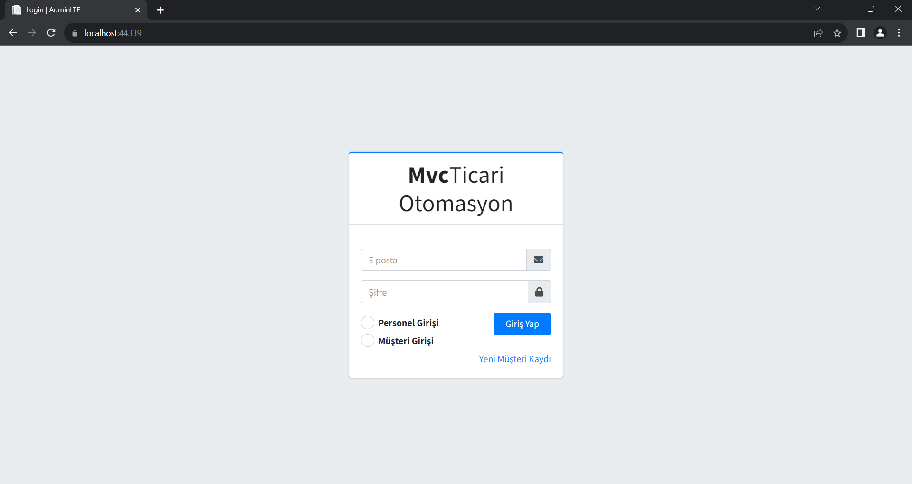
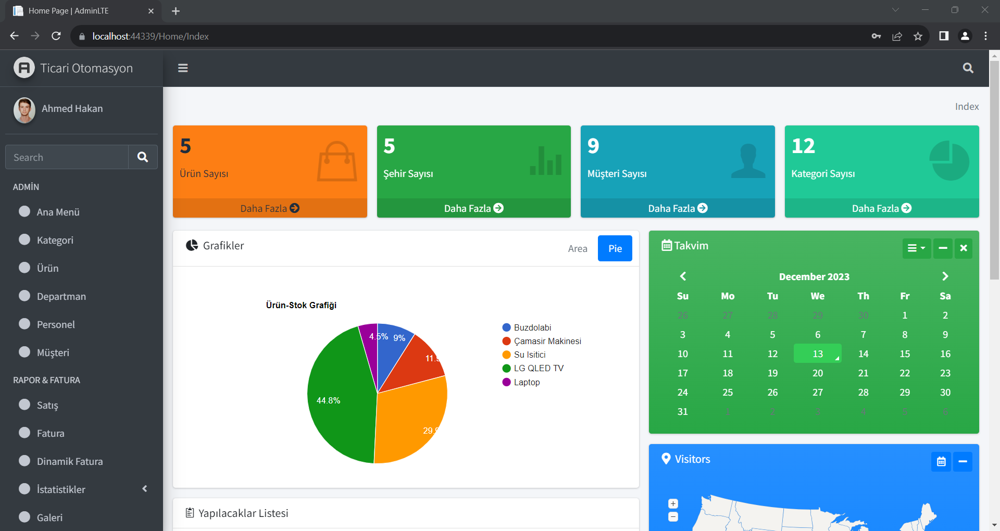
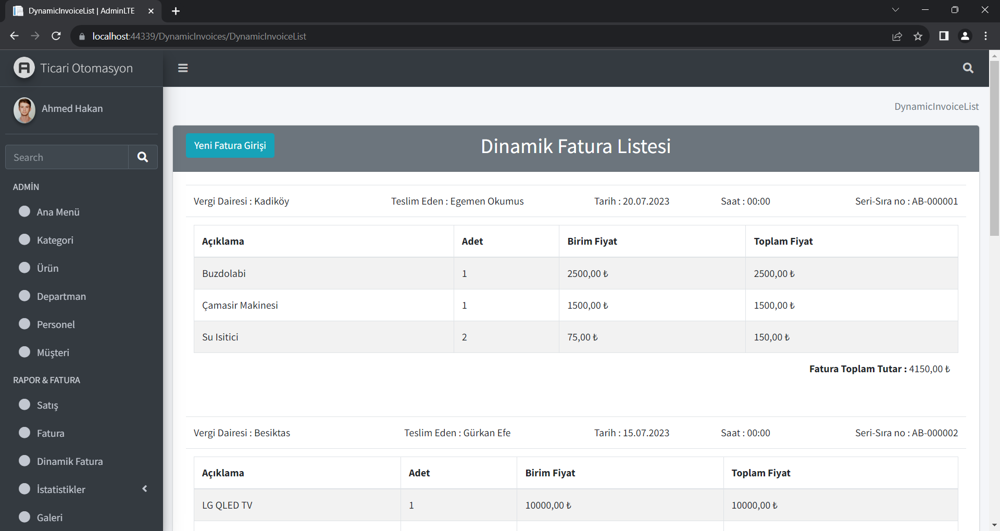
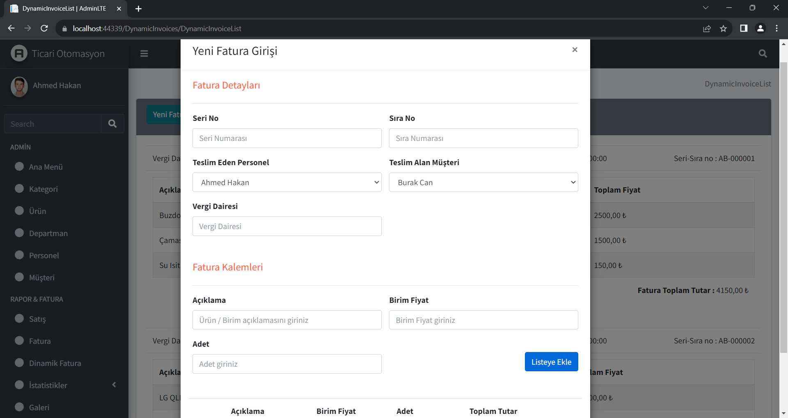

# Mvc Online Ticari Otomasyon

Bu proje ile personeller müşterilere satış yapabilmekte, bu satışlar veri tabanında kaydolmaktadır. Rol bazlı yetkilendirme ile bazı sayfalara girişler sınırlandırılmıştır. Fatura girişleri popup üzerinden yapılabimekte. BreadCrumb ile sayfalar arasında kolay gezinme.

## Ekler

Projede açık kaynak templateler gerkli düzenlemeler yapılarak kullanılmıştır.
## Katkı

Projede bir çok noktada eksiklerim olabilir bu konuda

Katkılara her zaman açığım!
  
## Ekran Görüntüleri
login page

home page

invoice page

invoice add

  
## Kullanılan Teknolojiler

**Teknoloji:** Asp.Net MVC5

## Destek

Destek için ahakanokumuss@gmail.com adresine e-posta gönderin veya Slack kanalımıza katılın.
